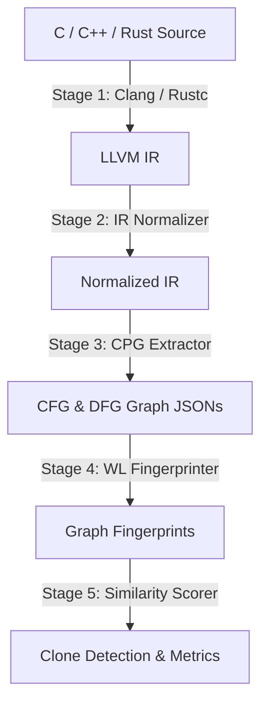

# CrossLangCloneIR

**CrossLangCloneIR** is a production-quality, cross-language semantic code clone detection prototype. It standardizes implementations written in diverse source languages (C, C++, Rust) into a common semantic representation built on **LLVM Intermediate Representation (IR)** and **Weisfeiler-Lehman Graph Fingerprints**.

---

## 🛠️ Pipeline Architecture

The clone detection system operates in five automated pipeline stages:



1. **LLVM IR Generation**: Source code from C, C++, and Rust is compiled to LLVM Intermediate Representation, bridging syntactic gaps.
2. **IR Normalization**: Debug attributes, compiler specifics, and SSA variable names are canonicalized to match equivalents.
3. **Graph Property Extraction**: Extracts a Control Flow Graph (CFG) and Data Flow Graph (DFG) from the IR. Uses Fraunhofer Code Property Graph (CPG) or a high-fidelity semantic Python fallback parser.
4. **WL Fingerprinting**: Computes Weisfeiler-Lehman (WL) graph isomorphism hashes for the CFG/DFG and bag-of-words opcode signatures.
5. **Weighted Scoring**: Evaluates similarities via the formula:
   $$\text{Similarity} = 0.4 \times S_{\text{CFG}} + 0.4 \times S_{\text{DFG}} + 0.2 \times S_{\text{Opcode}}$$

---

## 🚀 Getting Started

### Prerequisites
- Python 3.10+
- (Optional) Java JDK 17+ (only required for Gradle-based Fraunhofer CPG parser; otherwise, the Python-based high-fidelity parser handles graph extraction automatically).

### Setup and Build
Run the automated build script to install dependencies (`networkx`, `flask`, `click`, etc.) and set up directories:

**Linux / macOS / WSL**:
```bash
chmod +x build.sh
./build.sh
```

**Windows (cmd / PowerShell)**:
```cmd
build.bat
```

---

## 💻 Running the Pipeline

Execute the full analysis, detection, and evaluation suite on the 5-algorithm testcases corpus:

**Linux / macOS / WSL**:
```bash
chmod +x run.sh
./run.sh
```

**Windows (cmd / PowerShell)**:
```cmd
run.bat
```

This script:
1. Translates all programs under `testcases/` (Recursive Factorial, Double Recursive Fibonacci, Bubble Sort, Prime Checker, String Reversal) into LLVM IR, normalizes them, and parses their CFGs/DFGs.
2. Runs the clone detector at a similarity threshold of `0.85`.
3. Runs the evaluator to compare results against `testcases/expected_pairs.json` and outputs a precision, recall, and F1-score report under `evaluation/`.

---

## 🔍 CLI Usage

The unified CLI provides command-line control of the pipeline:

```bash
# 1. Analyze a source corpus (generates IR, normalizes, extracts CPG, and fingerprints)
python -m src.cli.main analyze testcases/

# 2. Detect clones from fingerprints directory at a specific similarity threshold
python -m src.cli.main detect --threshold 0.85

# 3. Compare two source files end-to-end (interactive mode)
python -m src.cli.main compare testcases/c/factorial.c testcases/rust/factorial.rs
```

---

## 🖥️ Visual Web Dashboard

The project includes an interactive, premium Flask-based visual dashboard to explore code, normalized IRs, and interactively compare graphs (CFG/DFG) side-by-side.

### Start the server:
```bash
python src/web/server.py
```
Open **`http://localhost:5000`** in your browser.

*The dashboard lets you edit code in real-time, view compiler-independent normalized IR, and visually inspect structural clone match indicators.*
