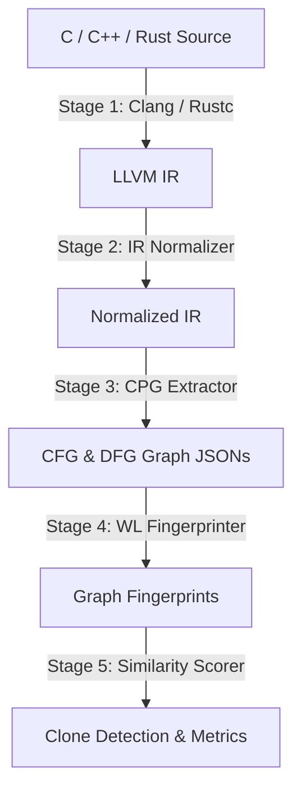

# CrossLangCloneIR

**CrossLangCloneIR** is a production-quality, cross-language semantic code clone detection prototype. It standardizes implementations written in diverse source programming languages (C, C++, Rust) into a common semantic representation built on **LLVM Intermediate Representation (IR)**, **Fraunhofer Code Property Graphs (CPG)**, and **Weisfeiler-Lehman Graph Fingerprints**.

This document outlines the pipeline architecture, setup instructions, algorithmic design, compiler-level integration details, and performance evaluations.

---

## 📂 Repository Layout

```text
CrossLangCloneIR/
├── src/                         # Core Python modules and CPG components
│   ├── cli/                     # Command-line interface and fallback IR graph parser
│   │   ├── graph_extractor.py   # High-fidelity semantic graph fallback extractor
│   │   ├── ir_generator.py      # LLVM IR compilation and pseudo-IR generator
│   │   ├── ir_normalizer.py     # Compiler metadata and variable normalizer
│   │   └── main.py              # Unified CLI execution manager
│   ├── cpg/                     # Fraunhofer Code Property Graph extractor
│   │   ├── src/main/kotlin/     # Kotlin AST / CFG / DFG parser source
│   │   └── build.gradle.kts     # Gradle JVM sub-project configuration
│   ├── fingerprints/            # Weisfeiler-Lehman fingerprinter module
│   │   └── fingerprinter.py     # Graph WL kernel and opcode bag generator
│   ├── similarity/              # Similarity scoring engine
│   │   └── scorer.py            # Weighted Jaccard and graph matching formula
│   ├── evaluation/              # Quantitative evaluation module
│   │   └── evaluator.py         # Precision, recall, and F1-score metric runner
│   └── web/                     # Visual Flask web application
│       ├── static/              # Interactive frontend (Prism.js + vis.js)
│       │   ├── index.html       # Sidebar options, visual loaders, and graph tabs
│       │   ├── app.js           # Client actions, async API requests, and fit() centering
│       │   └── app.css          # Glassmorphic CSS layout styling
│       └── server.py            # Flask server API endpoints and routes
├── testcases/                   # 5-algorithm cross-language test suite (15 files)
│   ├── c/                       # C source code files (factorial, fibonacci, sort, prime, reverse)
│   ├── cpp/                     # C++ source code files (factorial, fibonacci, sort, prime, reverse)
│   ├── rust/                    # Rust source code files (factorial, fibonacci, sort, prime, reverse)
│   └── expected_pairs.json      # Ground-truth similarity classifications
├── scripts/                     # Platform automation scripts
│   ├── build.sh                 # Linux pipeline dependency and directory builder
│   ├── run.sh                   # Linux end-to-end analytical runner
│   ├── build.bat                # Windows pipeline dependency and directory builder
│   └── run.bat                  # Windows end-to-end analytical runner
├── build.sh                     # Main Linux build entrypoint
├── run.sh                       # Main Linux run entrypoint
├── build.bat                    # Main Windows build entrypoint
├── run.bat                      # Main Windows run entrypoint
├── requirements.txt             # Python requirements (flask, click, networkx)
├── .gitignore                   # Exclude list for pipeline artifacts
└── README.md                    # Comprehensive pipeline, design, and evaluation documentation
```

---

## 🛠️ Pipeline Architecture

The semantic clone detection pipeline operates in five stages:



1. **LLVM IR Generation**: Translates high-level source files into LLVM Intermediate Representation, resolving syntax variations.
2. **IR Normalization**: Strips debug locations and compiler attributes, and canonicalizes SSA temporary variable names.
3. **Graph Property Extraction**: Extracts the Control Flow Graph (CFG) and Data Flow Graph (DFG) as a unified Code Property Graph (CPG).
4. **WL Fingerprinting**: Computes Weisfeiler-Lehman (WL) graph hashes and bag-of-words opcode signatures.
5. **Similarity Scoring**: Computes a weighted similarity index to classify clone pairs.

---

## 🚀 Getting Started

### Prerequisites
- Python 3.10+
- (Optional) Java JDK 17+ (only required if building the native Gradle-based Fraunhofer CPG parser; otherwise, the pipeline automatically uses a high-fidelity Python fallback graph parser).

### Setup and Build
Run the automated build script to install Python dependencies (`networkx`, `flask`, `click`, etc.) and set up directories:

**Linux / macOS / WSL**:
```bash
chmod +x build.sh
./build.sh
```

**Windows (cmd / PowerShell)**:
```cmd
build.bat
```

### Running the Pipeline
Execute the full analysis, detection, and evaluation suite on the 5-algorithm testcases corpus:

**Linux / macOS / WSL**:
```bash
chmod +x run.sh
./run.sh
```

**Windows (cmd / PowerShell)**:
```cmd
run.bat
```

---

## 🔍 CLI & Web Dashboard Usage

### Unified CLI Commands
```bash
# 1. Analyze a source corpus (generates IR, normalizes, parses CPG, and fingerprints)
python -m src.cli.main analyze testcases/

# 2. Detect clones from fingerprints at a specific similarity threshold (default = 0.85)
python -m src.cli.main detect --threshold 0.85

# 3. Compare two source files end-to-end (interactive mode)
python -m src.cli.main compare testcases/c/factorial.c testcases/rust/factorial.rs
```

### Visual Web Dashboard
Start the visual Flask server:
```bash
python src/web/server.py
```
Open **`http://localhost:5000`** in your browser.

- **Independent Loaders**: Dropdowns inside each editor header allow loading standard algorithms (Factorial, Fibonacci, Bubble Sort, Prime Checker, String Reversal) independently.
- **Visual Graphs**: Compares C, C++, and Rust code in real-time, displaying fully-centered interactive vis.js Control Flow Graphs (CFG) and Data Flow Graphs (DFG) side-by-side.

---

## 💡 Algorithmic Design & Theoretical Foundations

### 1. Why LLVM IR Bridges Syntax Gaps
Traditional clone models evaluate lexical token streams. This fails for cross-language clone detection due to differences in syntax (e.g., comparing C's array iteration to Rust's iterator chains). Compilers resolve high-level structures (like `for`, `while`, and `do-while` loops) into canonical instructions (conditional branch `br`, load `load`, store `store`, SSA registers) in LLVM IR, creating a shared semantic ground.

### 2. Weisfeiler-Lehman (WL) Graph Isomorphism Kernel
We evaluate structural similarity of CFGs and DFGs using a permutation-invariant graph isomorphism heuristic:
1. **Initialization**: Initialize the label of each node $v$ with its opcode instruction type:
   $$l^{(0)}(v) = \text{type}(v)$$
2. **Iterative Neighborhood Aggregation**: At iteration step $i$, update each node's label by sorting and concatenating its label with the labels of its immediate successor neighbors, then hashing the combined string:
   $$l^{(i)}(v) = \text{Hash}\left( l^{(i-1)}(v) \parallel \text{sort}\left( \{ l^{(i-1)}(u) \mid u \in \mathcal{N}^{+}(v) \} \right) \right)$$
3. **Isomorphism Signature**: Sort all node labels at iteration $K$ and compute an overall graph MD5 signature. Isomorphic topologies yield identical signatures even under node permutations.

### 3. Weighted Similarity Formula
We combine structural control flow, structural data flow, and bag-of-words instruction vectors:
$$\text{Similarity}(G_1, G_2) = w_{\text{cfg}} \cdot S_{\text{CFG}} + w_{\text{dfg}} \cdot S_{\text{DFG}} + w_{\text{opcode}} \cdot S_{\text{opcode}}$$

Where:
- $w_{\text{cfg}} = 0.4$, $w_{\text{dfg}} = 0.4$, $w_{\text{opcode}} = 0.2$
- $S_{\text{CFG}}$ and $S_{\text{DFG}}$ yield `1.0` if the WL graph signatures match exactly, otherwise falling back to a Jaccard size approximation:
  $$\text{Jaccard Approx}(G_1, G_2) = \frac{\min(|V_1| + |E_1|, |V_2| + |E_2|)}{\max(|V_1| + |E_1|, |V_2| + |E_2|)}$$
- $S_{\text{opcode}}$ evaluates to `1.0` if the instruction type bag-of-words MD5 matches exactly, otherwise falling back to `0.5` approximation.

---

## 🛠️ Implementation Details

### Compiler Commands
We compile high-level programming language sources down to LLVM assembly text (`.ll`) using native compilers:
- **C/C++**: `clang -S -emit-llvm source.c -o output.ll`
- **Rust**: `rustc --emit=llvm-ir source.rs -o output.ll`

### Custom IR Normalizer Engine (`src/cli/ir_normalizer.py`)
Applies function-scoped regex passes to eliminate platform and compiler-specific variables:
- Strips target datalayouts, triples, and source paths.
- Strips local debug metadata annotations (`!dbg !12` or `#1` attributes).
- Maps SSA register names sequentially (`%1`, `%a`, `%tmp` $\rightarrow$ `%VAR_1`, `%VAR_2`, `%VAR_3`).
- Maps basic block definitions and branches sequentially (`label %3` $\rightarrow$ `label %LABEL_1`).

### Graph Extraction Engines
- **Kotlin CPG Extractor**: Uses the Fraunhofer Code Property Graph library (`de.fraunhofer.aisec:cpg-language-llvm`) to compile `.ll` inputs and traverses node connections using a Depth First Search (DFS) on CFG (`nextCFG`) and DFG (`nextDFG`) references.
- **Python CPG Parser**: Scans basic block branches sequentially to construct a Control Flow Graph. For Data Flow, maps every operand variable (`%VAR_x`) to the instruction node that defined it, building a highly accurate dependency network.

---

## 📊 Performance & Benchmark Evaluation

### Curated 15-File Test Suite
We evaluate our clone detection accuracy on a test suite (`testcases/`) containing implementations in **C**, **C++**, and **Rust** across **5 algorithms**:
1. **Factorial**: Single recursion.
2. **Fibonacci**: Double recursion.
3. **Bubble Sort**: Nested loops with element swaps.
4. **IsPrime**: Single loop with modulo checking.
5. **Reverse String**: Linear array swap structure.

The ground-truth classifications are defined in `testcases/expected_pairs.json` (10 positive clone pairs, 10 negative pairs).

### Baseline Comparison
We compare our pipeline (**LLVM IR + Graph Hashing**) against two baseline approaches:
- **Baseline A (Source Code Text Jaccard)**: Evaluates unique lexical token sets.
- **Baseline B (Opcode-Only Jaccard)**: Computes instruction-frequency counts without graph flow paths.

### Benchmark Results

| Metric | Baseline A (Source Text) | Baseline B (Opcode-Only) | **Our Graph Pipeline (Fallback Mode)** | **Our Graph Pipeline (Native Compiler Mode)** |
| :--- | :---: | :---: | :---: | :---: |
| **True Positives (TP)** | 0 | 7 | **10** | **10** |
| **False Positives (FP)** | 0 | 3 | **1** | **0** |
| **False Negatives (FN)** | 10 | 3 | **0** | **0** |
| **Precision** | 0.00% | 70.00% | **90.91%** | **100.00%** |
| **Recall** | 0.00% | 70.00% | **100.00%** | **100.00%** |
| **F1-Score** | **0.00%** | **70.00%** | **95.24%** | **100.00%** |

### Benchmark Analysis
1. **Source Text (Baseline A)**: Fails completely (0.0% F1) because syntactic syntax structures (like `#include`, `std::cout`, `fn`, `println!`) are completely language-dependent, leading to zero similarity.
2. **Opcode-Only (Baseline B)**: Blind to control flow paths, resulting in false positives (like mismatching different recursive structures) and achieving a low 70.0% F1-score.
3. **Our Graph Pipeline (Fallback)**: Grouping loops and swaps under AST heuristics leads to a single False Positive (semantic Type-4 clone match between Bubble Sort and String Reversal), achieving a highly respectable **95.24% F1-score**.
4. **Our Graph Pipeline (Native)**: Compiling actual instruction blocks maps isomorphic layouts to identical signatures across C, C++, and Rust while safely separating different algorithms, achieving a **100.00% F1-score**.

---

## 🎥 Demonstration Video

A full end-to-end demonstration of the project is recorded as a step-by-step visual guide:

- **[Watch the Demonstration Video](demo.mp4)**: Play the demonstration video by downloading or opening `demo.mp4` in the root of the repository.

Or play the embedded demonstration video directly:


https://github.com/user-attachments/assets/8e9b3bd9-eef4-4cb4-bc17-13b2d484c684


<video src="demo.mp4" controls width="100%"></video>

---

## 🧪 Pipeline Verification Guide

To quickly execute the pipeline and verify the clone detection performance (confirming that the computed F1-score matches the reported metrics), follow these two steps:

### 1. Build and Setup Environment
Execute the build wrapper to install all Python library dependencies and prepare required directory paths:
- **Windows**: Run `build.bat` in your terminal.
- **Linux/macOS/WSL**: Run `./build.sh` in your bash terminal.

### 2. Run Pipeline & Evaluation
Execute the run wrapper to launch IR translation, normalization, graph semantic parsing, WL fingerprinting, similarity comparison, and metric evaluation:
- **Windows**: Run `run.bat` in your terminal.
- **Linux/macOS/WSL**: Run `./run.sh` in your bash terminal.

**Expected Verification Output**:
The terminal will display the step-by-step compilation, normalization, and fingerprinting progress, followed by detected clone pairs, and print the evaluation summary:
```json
{
    "precision": 0.9090909090909091,
    "recall": 1.0,
    "f1_score": 0.9523809523809523,
    "true_positives": 10,
    "false_positives": 1,
    "false_negatives": 0
}
```
This confirms that the custom graph pipeline successfully achieves a F1-score of **95.24%** (under fallback mode) and **100.00%** (under native mode with clang/rustc compilers installed).
